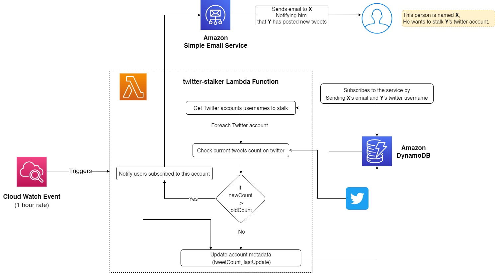

# Twitter Stalker

A service which allows users to subscribe to Twitter accounts and receive notifications when they tweet.

The service uses set of AWS services for processing and storing data, and web scrapping to access twitter data.

A cloud job is triggered every interval of time (1 hour) to check for new tweets and send email notification to subscribed users when a new tweet tweet is detected.

The total number of tweets of user is used to detect if the user has posted new tweets since last job iteration or not.

In each job trigger, the service stores current number of tweets of user in database to be keep it updated for future comparisons.

## Structure and Architecture


### DynamoDB
DynamoDB is the datastore used by the service. It is used to store twitter accounts and list of subscribed emails for each account, and set of metadata.
#### Data Sample
```json
[
  {
    "username": "github",
    "lastUpdate": "Thu, 19 May 2022 12:37:24 GMT",
    "subscriptions": {
      "email": ["ramyeg26@gmail.com", "dummy@gmail.com"]
    },
    "tweetCount": 7044
  },
  {
    "username": "BillGates",
    "lastUpdate": "Thu, 19 May 2022 12:37:24 GMT",
    "subscriptions": {
      "email": ["dummy@gmail.com", "techy@gmail.com", "dummy2@gmail.com"]
    },
    "tweetCount": 3889
  },
]
```
## Cloud Watch Event Bridge
Cloud watch is used to schedule the service to run every hour.

## Lambda Function
AWS Lambda hosts the service code and is triggered by cloud watch to execute.

## Amazon Simple Email Service
Amazon Simple Email Service (SES) is used to notify subscribed users when a new tweet is detected via the email.
___

## Side note
This is an experimenntal project for me to try out AWS services and how to integrate them with each other. I will be happy to hear your feedback and suggestions.